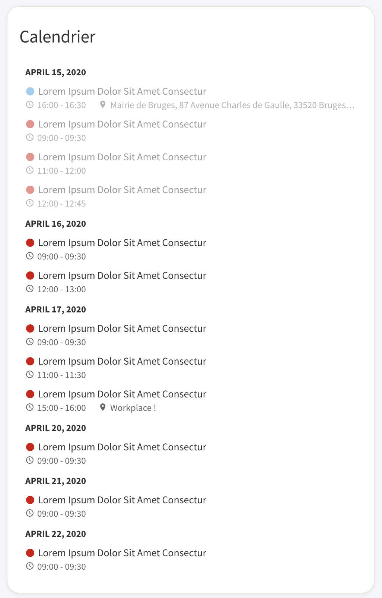

# Lovelace Nonow Calendar

A custom [Lovelace](https://www.home-assistant.io/lovelace/) component for displaying a calendar for [Home Assistant](https://github.com/home-assistant/home-assistant).

Current version: **0.0.1**

## Screenshots



## Install

### Simple install

1. Download and copy [lovelace-nonow-calendar.js](https://raw.githubusercontent.com/brunosabot/lovelace-nonow-calendar/master/lovelace-nonow-calendar.js) into your `config/www` directory.

2. Add a reference to `lovelace-nonow-calendar.js` inside your `ui-lovelace.yaml`.

```yaml
resources:
  - url: /local/lovelace-nonow-calendar.js?v=0.0.1
    type: module
```

### Installation using Git

**Clone this repository into your `config/www` folder using git.**

```console
$ git clone https://github.com/brunosabot/lovelace-nonow-calendar.git
```

**Add a reference to the card in your `ui-lovelace.yaml`.**

```yaml
resources:
  - url: /local/lovelace-nonow-calendar/lovelace-nonow-calendar.js?v=1
    type: module
```

## Updating

1. Find your `lovelace-nonow-calendar.js` file in `config/www` or wherever you ended up storing it.

2. Replace the local file with the latest one attached in the here: [lovelace-nonow-calendar.js](https://raw.githubusercontent.com/brunosabot/lovelace-nonow-calendar/master/lovelace-nonow-calendar.js).

3. Change the version number with the new one to the end of the cards reference url in your `ui-lovelace.yaml` like below.

```yaml
resources:
  - url: /local/lovelace-nonow-calendar.js?v=0.0.2
    type: module
```

_You may need to empty the browsers cache if you have problems loading the updated card._

## Using the card

### Options

#### Card options

| Name           | Type    | Default      | Since  | Default           | Description                                 |
| -------------- | ------- | ------------ | ------ | ----------------- | ------------------------------------------- |
| type           | string  | **required** | v0.0.1 |                   | `custom:lovelace-nonow-calendar`            |
| entities       | string  | **required** | v0.0.1 |                   | A list of calendar **entities**             |
| daysToShow     | integer | optional     | v0.0.1 | 7                 | How many day to show in the calendar        |
| loadingMessage | string  | optional     | v0.0.1 | Loading...        | The loading message                         |
| noEventMessage | integer | optional     | v0.0.1 | No upcoming event | The message display when there is no events |
| title          | integer | optional     | v0.0.1 | Calendar          | The card title                              |
| showColor      | integer | optional     | v0.0.1 | true              | Show the color chip in the calendar view    |
| showLocation   | integer | optional     | v0.0.1 | true              | Show the event location in calendar view    |

#### Entities

| Name   | Type   | Default      | Since  | Default          | Description                   |
| ------ | ------ | ------------ | ------ | ---------------- | ----------------------------- |
| entity | string | **required** | v0.0.1 |                  | A calendar entity             |
| color  | string | optional     | v0.0.1 | _auto-generated_ | The calendar associated color |

### Example usage

#### Simple usage

```yaml
- type: custom:lovelace-nonow-calendar
  entities:
    - entity: calendar.my_calendar_name
```

#### Advanced configuration

```yaml
- type: custom:lovelace-nonow-calendar
  daysToShow: 2
  loadingMessage: Work in progress...
  noEventMessage: Nothing yet.
  title: Nonow's calendar
  showColor: false
  showLocation: false
  entities:
    - entity: calendar.my_calendar_name
      color: "rgb(64, 189, 245)"
```

## License

This project is under the MIT licence
